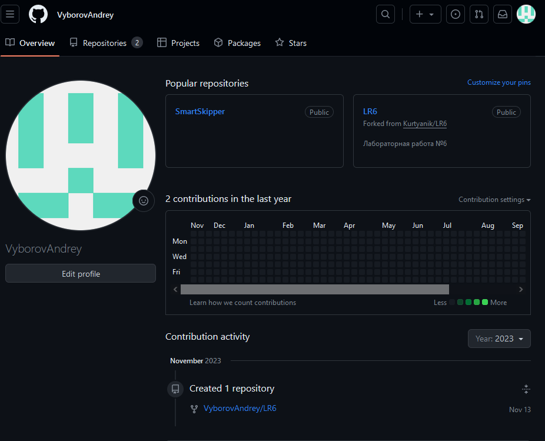
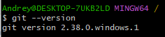

# Лабораторная работа №6 Система контроля версий
### Цель работы
Изучение базовых возможностей системы управленияя версиями, опыт работы с Git Api, опыт работы с локальным и удаленным репозиторием.

### Ход работы
1. Создаем аккаунт на сайте GitHub и создаем копию репозитория лабораторной работы в личное хранилище. Для этого надо перейти в репозиторий с лабораторнй работой и нажать на кнопку "fork". 
   - [Ccылка на аккаунт](https://github.com/VyborovAndrey) 
      

         
         Рисунок 1 - Аккаунт GitHub и созданный fork репозитория
      

2. Устанавливаем Git.
   - Для того чтобы установить Git необходимо перейти на официальный сайт Git и оттуда скачать клиент Git совместимый с нашей операционной системой.
      

          
         Рисунок 2 - Версия установленного Git
      

3. Настраиваем клиент Git
    - Для того чтобынатсроить клиент Git необходимо выполнить следующие действия:
      - Выполнить команду `git config --global user.name имя_пользователя` для установки имени пользователя.
      - Выполнить команду `git config --global user.email email_пользователя` для установки email пользователя.
         

             
            Рисунок 3 - Настройка клиента Git
         

4. Создаем локальную копию удаленного репозитория
   - Для того чтобы клонировать репозиторий к себе на компьютер необходимо выполнить следующие действия:
     - Перейти в желаемое место расположения репозитория с помощью команды `cd название_папки`.
     - С помощью команды `git clone адрес_репозтория` скопировать репозиторий.
      

          
         Рисунок 4 - Создание локальной копии удаленного репозитория
      

5.  Добавляем тестовый файл через интерфейс GitHub
    - Для того чтобы добавить тестовый файл в наш репозиторий переходим на страницу нашего репозитория на сайте GitHub. После этого нажимаем на кнопку "Add file". В окне создания файла даем ему название "Test_file.txt". После подтверждения создания файла автоматически содается коммит "Create Test_file.txt".
      

          
         Рисунок 5 - Созданный файл через интерфейс GitHub
      

6. Добовление созданного файла в локальный репозиторий
   - Для подтягивания созданного файла используется команда `git pull`
      

          
         Рисунок 6 - Подтягивание файла с помощью git pull
      

7. Получаем и просматриваем историю операций
   - Для того чтобы получить историю операция для ветки воспользуемся командой `git log`. 
      

          
         Рисунок 7 - Просмотр истории операций 
      
 
8. Создание новой ветки
   - Для создания новой ветки была использована команда `git branch название_ветки`, для перехода в новую ветку была использована команда `git checkout название_ветки`
      

          
         Рисунок 8 - Создание новой ветки 
      
 
   - В этой новой ветке был изменен файл mergefile.txt для создания конфликта при слиянии, был сделан коммит с изменением этого файла.
      

          
         Рисунок 9 - Изменение файла mergefile.txt 
      
  
9. Слияние двух веток
   - Чтобы выполнить слияние созданных веток нужно перейти в ветку в которую будет произведено слияние (в нашем случае master), и использовать команду `git merge название_ветки`
      

          
         Рисунок 10 - Слияние веток 
      

10. Удаление оставшейся после слияния ветки
    - Для удаления ветки используется команда `git branch -d название_ветки`
      

          
         Рисунок 11 - Удаление ненужной ветки 
      
 
11. Создаем новый файл и изменяем его несколько раз, откатываем коммит
      

          
         Рисунок 12 - Создание новых файлов и удаление одного из них
      

      

          
         Рисунок 12 - Отмена последнего комита
      

12. Создаём ветку для отчёта
      

          
         Рисунок 12 - Создание новой ветки
      

13. Получение истории операций в форматированном виде
    - Для получения истории операций в необходимом формате используется команда `git log --pretty=format:"%h + %cd + %an + %s"`
      

          
         Рисунок 14 - История операций для ветки master
      

      

          
         Рисунок 15 - История операций для ветки report
      

### Вывод
   Изучили базовые возможности системы управленияя версиями. Получили опыт работы с Git Api, локальным и удаленным репозиторием. Научились работать с файлами markdown. 